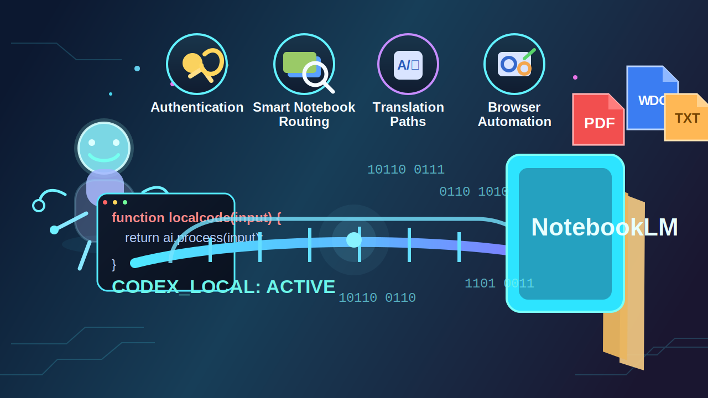

# NotebookLM Codex Bridge



Turn Codex into a practical local bridge to Google NotebookLM so you can ask questions from Codex and get answers grounded in your uploaded NotebookLM sources.

## Install

```text
$skill install https://github.com/Slow-Voice/notebooklm-codex-bridge/tree/main/notebooklm-codex-bridge
```

Run that command inside the Codex client. It has been re-verified against the Codex GitHub skill installer on March 16, 2026.

## Language Switch

- [中文说明](#中文说明)
- [English Guide](#english-guide)

---

## 中文说明

### 这个项目是什么

`notebooklm-codex-bridge` 是一个把 Codex 和 Google NotebookLM 连接起来的本地 skill。

它解决的是一个非常实际的问题: 很多资料其实已经整理在 NotebookLM 里了, 但平时写代码、写文档、问问题的时候, 你又是在 Codex 里工作。如果每次都要手动打开 NotebookLM、切换笔记本、输入问题、复制答案、再贴回 Codex, 整个流程就会变得很碎, 也很容易打断思路。

这个项目的核心价值, 就是把上面那条断裂的流程接起来。你继续在 Codex 里提问, skill 在后台帮你连接 NotebookLM, 自动选择合适的 notebook, 把问题发过去, 然后再把 NotebookLM 的回答带回当前对话。

更重要的是, 这个流程不是让 Codex 自己“猜”答案, 而是优先依赖你已经上传到 NotebookLM 的资料来回答。对于内部文档、研究笔记、论文资料、项目 SOP、实验记录、课程材料, 这种方式通常比裸问模型更稳, 也更接近“基于来源回答”的工作流。

### 它能帮你做什么

这个项目不是一个单点脚本, 而是一套围绕 NotebookLM 使用体验做出来的完整桥接方案。

它主要包含这些能力:

- 持久认证: 第一次完成 Google 登录后, skill 会在本地保存浏览器状态, 后续不需要反复重新登录。
- 智能 notebook 路由: 如果你本地维护了多个 notebook, 它会根据你的请求尽量挑出最相关的那个。
- 本地 notebook library 管理: 可以同步、记录、搜索、激活你常用的 NotebookLM notebooks。
- 中英文双通路: 你可以在 Codex 中用中文说需求, skill 会根据流程自动处理, 尽量减少因为浏览器自动化输入非 ASCII 文本带来的问题。
- 浏览器自动化提问: 在没有官方公开 NotebookLM API 的情况下, 它通过浏览器自动化完成真实交互。
- 结果回流 Codex: 你不需要自己复制粘贴, NotebookLM 的结果会回到当前 Codex 对话中。
- 来源约束更强: 当你的资料都已经上传进 NotebookLM 后, 这条链路能显著降低“脱离资料乱答”的风险。

### 为什么它比“直接问模型”更有意义

很多人第一次看到这个项目时, 会问一句: “我为什么不直接问 Codex?”

答案其实很简单。直接问模型当然快, 但它依赖的是模型自己已有的知识和推断能力。只要你问的是私人资料、内部项目、尚未公开的研究笔记、个人文献库, 模型并没有天然访问权。这时直接问, 它要么答不出来, 要么会开始补全、猜测、泛化。

而这个项目的思路是反过来的:

1. 你的知识源先放在 NotebookLM。
2. NotebookLM 负责围绕这些来源组织和回答。
3. Codex 负责成为你的工作界面和自动化入口。
4. 两者通过本地 skill 连起来。

这样一来, 你保留了 Codex 的交互效率, 也保留了 NotebookLM 对来源材料的依赖能力。

### 它在实际使用时是什么感觉

从用户视角来看, 这个项目的目标体验非常简单:

1. 你在 Codex 里直接说一句话。
2. 如果你显式写了 `$NotebookLM Bridge ...`, Codex 会把它当成 NotebookLM 查询请求。
3. skill 会检查本地认证状态和 notebook library。
4. 如果本地 library 为空, 它可以先刷新 NotebookLM 首页信息。
5. skill 自动判断应该去哪个 notebook 里问。
6. 它通过浏览器自动化把问题发给 NotebookLM。
7. 最终, 结果回到你当前的 Codex 聊天窗口。

你不再需要反复切网页、手动选 notebook、来回复制答案。整个过程更像是“NotebookLM 成了 Codex 的一个后端知识引擎”。

### 主要功能详解

#### 1. 持久 Google 认证

这是这个项目最重要的基础能力之一。

NotebookLM 本身是 Google 生态里的网页产品, 因此真实可用的自动化流程必须处理登录状态。这个 skill 会在本地保存浏览器 profile 和认证状态, 所以你不需要每次查询都重新走一遍登录流程。

这意味着它更适合长期使用, 而不是一次性演示脚本。

#### 2. Smart Notebook Routing

如果你只有一个 notebook, 直接提问已经很好用。但一旦你开始把不同研究主题、不同项目、不同资料库都放进 NotebookLM, “到底问哪一本”就变成新的问题。

这个项目通过本地 notebook library 来解决这个问题。它可以存储 notebook 的 URL、名称、描述、主题标签以及活跃状态。之后当你在 Codex 中提出请求时, 系统可以根据你的描述去匹配最可能正确的 notebook。

这会让交互从“先找资料, 再提问”变成“直接问问题, 系统自己去找对应资料”。

#### 3. 本地 Notebook Library 管理

这个功能很像给 NotebookLM 增加了一个本地索引层。

NotebookLM 本身有自己的网页入口, 但在自动化场景里, 你往往需要一个本地可操作的目录, 方便脚本知道有哪些 notebooks、哪个是当前活跃 notebook、哪些 notebook 需要优先匹配。这个项目把这部分能力做成了可管理的本地 library。

这对于长期维护多个研究笔记本尤其重要。

#### 4. 中文和英文的协作路径

浏览器自动化在处理多语言输入时, 尤其是中文, 常常会遇到编码、输入法、网页控件兼容等现实问题。这个项目并不是简单假装这些问题不存在, 而是针对它设计了一条更稳的路径。

简单说就是: 你仍然可以用中文向 Codex 提需求, 但 skill 在内部会走更稳定的处理流程, 尽量把真正发送到 NotebookLM 的内容变成兼容性更好的形式。这样做的目的不是让你改用英文工作, 而是让你的中文工作流更稳定。

#### 5. 浏览器自动化

因为 NotebookLM 没有一个公开、稳定、直接面向这种本地 skill 场景的官方 API, 所以这个项目使用浏览器自动化来完成真实交互。

这听起来像“曲线方案”, 但它的好处是很现实: 只要网页可访问、登录状态可复用、页面结构没有发生破坏性变化, 这个方案就能工作。

这让项目从“概念上可行”变成“在个人工作流里真的能用”。

#### 6. 低幻觉、强来源依赖

对于很多研究、医疗、企业内部知识管理场景来说, 最重要的不是“答得多快”, 而是“答得是不是建立在你自己的材料上”。

这个项目的优势就在这里。你不是把文档重新粘贴进当前上下文, 也不是让模型离开来源自由发挥, 而是尽量通过 NotebookLM 的来源机制来约束答案生成。

这并不意味着答案永远绝对正确, 但它确实能把工作流推向一个更稳的方向: 更少的凭空补全, 更多的资料依赖。

### 适合哪些使用场景

这个项目特别适合下面这些情况:

- 你已经把论文、课题资料、研究笔记上传到了 NotebookLM。
- 你平时主要在 Codex 中工作, 希望不要在多个工具间频繁切换。
- 你需要围绕私有资料问答, 而不是只问公开知识。
- 你希望把 Codex 变成一个面向自己文档库的智能入口。
- 你希望尽量减少幻觉, 尤其是在科研、专业写作、内部知识检索这类高上下文任务里。

### 你可以怎么和它交互

安装完成后, 最自然的方式就是直接在 Codex 里说:

```text
$NotebookLM Bridge 帮我总结这个 notebook 的研究目标和方法路线
```

或者:

```text
$NotebookLM Bridge 只根据我上传到 NotebookLM 的资料回答
```

再比如:

```text
$NotebookLM Bridge 帮我找乳腺癌那个 notebook, 总结它的预测方案
```

这种体验的重点不是命令多复杂, 恰恰相反, 是你几乎不用记太多命令。

### 项目结构一眼看懂

这个仓库目前是“项目介绍仓库 + 可安装 skill 目录”的组织方式。

根目录主要负责项目说明, 真正用于 `$skill install` 的 skill 在下面这个目录中:

```text
notebooklm-codex-bridge/
```

这个 skill 目录里包含:

- `SKILL.md`: skill 的核心说明和触发逻辑
- `agents/openai.yaml`: Codex 客户端展示元数据
- `scripts/`: 认证、提问、路由、清理、环境启动等脚本
- `references/`: setup 和维护参考资料

### 安全和使用边界

这个项目虽然很好用, 但它不是“零边界”的。

你需要知道这些现实限制:

- 它依赖浏览器自动化, 因此网页 UI 改动可能影响稳定性。
- 它需要本地保存登录状态, 所以你应该认真对待本机安全。
- 如果你非常敏感, 建议为自动化流程使用专门的 Google 账号。
- 它的目标是减少幻觉, 不是承诺绝对不会出错。
- notebook 选择是智能匹配, 不是魔法, notebook 的命名和描述越清晰, 路由通常越稳定。

### 一句话总结

如果用一句最简单的话来概括这个项目, 那就是:

它把 Codex 变成了一个可以直接调用你自己 NotebookLM 知识库的工作入口。

---

## English Guide

### What this project is

`notebooklm-codex-bridge` is a local Codex skill that connects Codex to Google NotebookLM.

It solves a very practical workflow problem. Many people already keep their papers, notes, internal docs, and project materials inside NotebookLM. At the same time, their day-to-day work happens in Codex. Without a bridge, the workflow becomes fragmented: open NotebookLM, find the right notebook, ask a question, copy the answer, return to Codex, and paste everything back.

This project removes that friction. You stay inside Codex, while the skill handles the NotebookLM interaction in the background and brings the answer back into the same conversation.

The most important idea is that this is not about asking Codex to improvise. It is about using NotebookLM as the grounded source layer and letting Codex become the interface and automation layer.

### What it can do

This project is more than a single script. It is a complete local workflow layer for using NotebookLM from Codex.

Its main capabilities include:

- Persistent authentication so you do not need to log in again for every query
- Local notebook library management
- Smart notebook routing based on your request
- Chinese-to-English handling paths for more stable browser automation
- Real browser automation for NotebookLM interaction
- Answer handoff back into Codex chat
- Stronger source grounding for private or specialized material

### Why this matters

A common question is: why not just ask Codex directly?

The answer is that direct model prompting is not the same thing as source-grounded retrieval over your private materials. If your real knowledge lives in NotebookLM, then asking Codex directly often means asking it to infer, generalize, or guess beyond what it truly has access to.

This bridge changes that pattern:

1. Your knowledge stays in NotebookLM.
2. NotebookLM answers from the sources you uploaded there.
3. Codex becomes the place where you work and ask.
4. The skill connects both sides automatically.

That makes the workflow more practical for research, internal documentation, study notebooks, and any task where source alignment matters more than generic fluency.

### What the user experience feels like

From the user's perspective, the desired experience is simple:

1. You ask a question in Codex.
2. If you explicitly start with `$NotebookLM Bridge`, Codex treats it as a NotebookLM request.
3. The skill checks authentication and the local notebook library.
4. If needed, it refreshes the notebook list from NotebookLM home.
5. It chooses the most relevant notebook.
6. It sends the question through browser automation.
7. It returns the NotebookLM result to the same Codex conversation.

The goal is not to give you more steps. The goal is to remove steps.

### Feature breakdown

#### 1. Persistent Google authentication

NotebookLM is part of the Google ecosystem, which means real automation must deal with login state. This skill stores local browser state so that a successful sign-in can be reused across sessions.

That makes it suitable for real day-to-day work, not just one-off demos.

#### 2. Smart notebook routing

As soon as you have more than one notebook, routing becomes a real problem. This project solves that by keeping a local library of notebooks with names, descriptions, topics, URLs, and active state.

Instead of forcing you to manually identify the notebook first, it tries to infer which notebook is the best match for your request.

#### 3. Local notebook library management

Think of this as a small operational layer on top of NotebookLM. The web UI is where notebooks live, but automation needs a local structure it can search, refresh, and reuse. This project provides that structure so the bridge stays practical over time.

#### 4. Translation-aware request handling

Browser automation and multilingual text input do not always play nicely together, especially in complex web applications. This project handles that reality with a more stable internal path. You can still work from Chinese prompts in Codex, while the skill uses a compatibility-minded request flow under the hood.

#### 5. Browser automation

Because there is no public NotebookLM API designed for this exact local skill workflow, the project uses browser automation to drive the real NotebookLM interface. That may sound indirect, but it is also what makes the bridge usable today.

#### 6. Lower hallucination risk

For research, professional writing, and internal knowledge work, the main question is often not "can the model answer?" but "is the answer grounded in my own sources?"

This project helps move the workflow in that direction. It does not guarantee perfect truth, but it does make source alignment much stronger than a purely free-form model interaction.

### Good use cases

This project is a strong fit when:

- your papers or notes already live in NotebookLM
- your daily work happens inside Codex
- you want answers based on private materials
- you want less app switching
- you care about grounded answers more than generic model fluency

### How you can talk to it

After installation, the most natural pattern is to ask directly in Codex:

```text
$NotebookLM Bridge summarize the research goal and modeling pipeline in my notebook
```

Or:

```text
$NotebookLM Bridge answer only from my uploaded NotebookLM sources
```

Or:

```text
$NotebookLM Bridge find the breast cancer notebook and summarize its prediction strategies
```

The goal is to keep the interaction natural and short.

### Repository layout

This repository is organized as a project-introduction root plus an installable skill directory.

The actual skill used by `$skill install` lives here:

```text
notebooklm-codex-bridge/
```

Inside that directory you will find:

- `SKILL.md` for trigger logic and workflow instructions
- `agents/openai.yaml` for Codex UI metadata
- `scripts/` for setup, auth, routing, querying, and cleanup
- `references/` for setup and maintenance notes

### Security and limitations

This project is useful, but it is not magic.

Please keep these boundaries in mind:

- It depends on browser automation, so UI changes can break selectors.
- It stores local authentication state, so local machine security matters.
- A dedicated Google account is safer for automation-heavy workflows.
- It is designed to reduce hallucination risk, not eliminate all mistakes.
- Notebook routing is heuristic, so clear notebook names and descriptions help.

### One-sentence summary

If you want the shortest possible description, it is this:

This project turns Codex into a practical front door to your own NotebookLM knowledge base.
